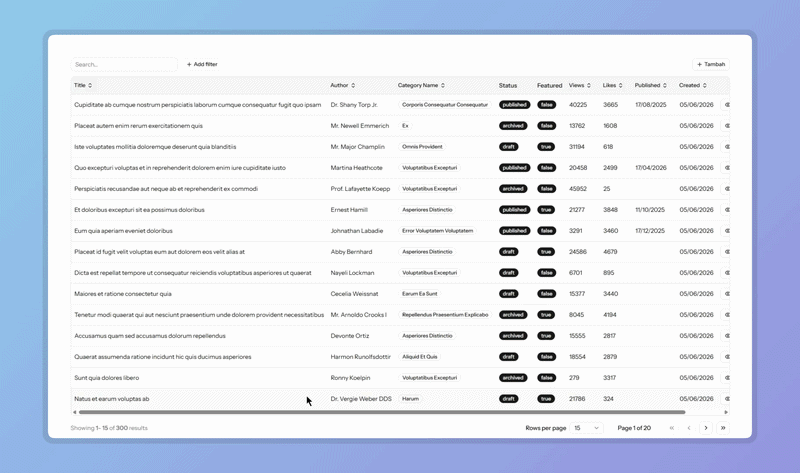

<div align="center">

# Kinetics

**Zero-Friction Tables for Inertia.js**

[](https://packagist.org/packages/mdaushi/kinetics)
[](https://www.npmjs.com/package/@mdaushi/kinetics-react)
[](https://github.com/mdaushi/kinetics/actions/workflows/tests.yml)
[](https://packagist.org/packages/mdaushi/kinetics)

Kinetics follows a simple philosophy: **Laravel is the brain**. All sorting, searching, filtering, and pagination logic lives on the server. The frontend is a pure renderer.

[Documentation](#documentation) · [Quick Start](#installation) · [Roadmap](#roadmap) · [Contributing](#contributing)

</div>

---



---

## Why Kinetics?

Most datatable libraries make you duplicate logic — sorting on the client, filtering on the server, pagination somewhere in between. Kinetics has one rule: **all data logic belongs to Laravel**. The frontend receives a result and renders it. Nothing more.

```
Request → [SortPipe → SearchPipe → FilterPipe → PaginatePipe] → TableResult → JSON → <Table />
```

## Features

- **Server-side everything** — sort, search, filter, and paginate via Eloquent; no client-side data processing
- **Zero-boilerplate frontend** — one `<Table />` component renders the full UI out of the box
- **Composable pipeline** — add, remove, or replace query pipes to fit any use case
- **Action columns** — per-row buttons and dropdown groups with visibility and disabled conditions
- **TanStack Table** — full access to the underlying table instance for custom layouts
- **shadcn/ui components** — polished, accessible UI included; no separate installation needed
- **TypeScript-first** — fully typed props, hooks, and column definitions

---

## Installation

**1. Laravel package**

```bash
composer require mdaushi/kinetics
```

**2. React package**

```bash
npm install @mdaushi/kinetics-react
```

**3. Configure Tailwind CSS**

Kinetics ships Tailwind classes in its dist. Tell Tailwind to scan the package so those classes aren't purged.

<details>
<summary><strong>Tailwind v4</strong></summary>

Add `@source` to `resources/css/app.css`:

```css
@import "tailwindcss";

@source "../../node_modules/@mdaushi/kinetics-react/dist";
```

</details>

<details>
<summary><strong>Tailwind v3</strong></summary>

Add the path to `tailwind.config.js`:

```js
export default {
  content: [
    // ... existing paths
    "./node_modules/@mdaushi/kinetics-react/dist/**/*.js",
  ],
};
```

</details>

---

## Quick Start

**1. Define your table**

```php
use Kinetics\Table;
use Kinetics\Columns\TextColumn;

$posts = Table::model(Post::class)
  ->columns([
    TextColumn::make('title')
      ->sortable()
      ->searchable(),
    TextColumn::make('user.name')
      ->label('Author')
      ->sortable()
      ->searchable(),
    TextColumn::make('status')
      ->badge(),
  ])
  ->make();

  return Inertia::render('posts', ['posts' => $posts]);
```

**2. Render on the frontend**

```tsx
import { Table } from "@mdaushi/kinetics-react";

export default function Post() {
  return (
    <div className="container mx-auto mt-20">
      <Head title="Posts — Table Test" />
      <Table table="posts" />
    </div>
  );
}
```

---

## Documentation

| Guide                                          | Description                                             |
| ---------------------------------------------- | ------------------------------------------------------- |
| [Backend (Laravel)](./docs/laravel-backend.md) | Columns, actions, pipes, full API reference             |
| [Frontend (React)](./docs/react-frontend.md)   | `<Table />` component and `useTable` hook               |
| [Custom Pipes](./docs/custom-pipes.md)         | Creating custom pipes + built-in pipe reference         |
| [Architecture](./docs/architecture.md)         | Internal design: pipelines, contexts, response builders |

---

## Roadmap

- [ ] Export (CSV / XLSX) — respects active filters, skips pagination
- [ ] Bulk actions — checkbox selection + batch operations
- [ ] Column visibility toggle — persist per-user
- [ ] Saved filter presets
- [ ] Vue adapter (`@kinetics/vue`)

---

## Contributing

Contributions are welcome — bug fixes, new features, or documentation improvements.

### Local Setup

```bash
# 1. Clone
git clone https://github.com/mdaushi/kinetics
cd kinetics

# 2. Install dependencies
composer install
pnpm install

# 3. Build packages (core first, then react)
pnpm --filter @mdaushi/kinetics-core run build
pnpm --filter @mdaushi/kinetics-react run build

# 4. Run tests
composer test

# 5. Lint
composer lint        # Check
composer lint:fix    # Fix
```

### Project Structure

```
kinetics/
├── src/                     # Laravel package
│   ├── Table.php            # Main entry point
│   ├── Columns/             # Column, ActionColumn
│   ├── Actions/             # Action, ActionGroup
│   ├── Pipes/               # Query pipeline stages
│   ├── Resources/           # TableResult (response formatter)
│   └── Support/             # TableConfig, TableContext
├── packages/
│   ├── core/                # @mdaushi/kinetics-core
│   └── react/               # @mdaushi/kinetics-react
│       └── src/
│           ├── components/  # <Table>, ActionCell, Toolbar, Pagination
│           └── hooks/       # useTable
├── tests/                   # PHPUnit test suite
└── docs/                    # Documentation
```

### Guidelines

- **PHP** — PSR-12 style. Add PHPUnit tests for any new feature or fix under `tests/`.
- **React/TS** — keep components headless-friendly; UI logic belongs in `hooks/`, not in components.
- **New pipe** — implement `PipeInterface`, add to `src/Pipes/`, document in `docs/laravel-backend.md`.
- **Commits** — use [Conventional Commits](https://www.conventionalcommits.org/) (`feat:`, `fix:`, `docs:`, `chore:`).

[Open an issue](https://github.com/mdaushi/kinetics/issues) for bugs or feature requests.

---

### Reporting Issues

Please [open an issue](https://github.com/mdaushi/kinetics/issues) with a clear description and, where possible, a minimal reproduction.
